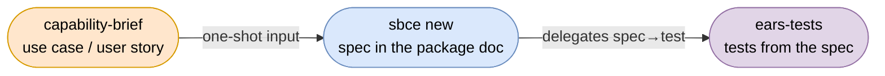

# capability-brief

An [AIrails.dev](https://airails.dev) skill that captures one capability, or one addition to a
capability, as a **brief** — a use case or a user story complete enough that
[`/sbce new`](../sbce) authors the spec in one shot. The clarifying interview `new` runs
against a vague feature description moves here, to authoring time with the domain owner, and its
answers are recorded once.

## Scope

- Two formats, one skill: a **use case** for a new capability with several steps, actors or kept state; a **user story** for one behaviour added to an existing capability. The skill routes by the input's shape and switches when it changes
- An **interview** that fills the template from the author's words, scans the repository read-only (existing package docs, the system doc's decisions and language, whether a stack is declared), then asks one gap per question — only what a human can answer: result shape, input parts and validation, repeated requests, external failures, lifecycle end, rejected alternatives
- A **completeness checklist** every brief passes before it is emitted: every actor step named as an operation, every input with its parts, every operation with its failure cases, every supporting actor tagged as a capability or external, lifecycle and entities stated or `none`, decisions with rejected alternatives, open issues holding only unanswered questions
- Stack-neutral — what the system promises, never how it is built; a type, transport or framework offered by the author is kept out
- The brief is **inception input, not a source of truth** — the same status as the README seed `/sbce new` reads. Once the spec exists in the package doc, the spec is authoritative
- Templates: [references/use-case-template.md](references/use-case-template.md), [references/user-story-template.md](references/user-story-template.md); each carries a filled example and states how its sections become the spec

## Composition

- [`sbce`](../sbce) consumes the brief: its `new` mode treats a filled brief as the completed clarify loop, its `## Capability` as the confirmed carving, each `record:` as a confirmed decision, and asks only what `## Open issues` lists
- [`ears-tests`](../ears-tests) is downstream of the spec; a brief never contains test wording
- No stack skill is involved; the brief is upstream of any stack



## Usage

Describe the capability in domain language; the skill picks the format, interviews until the
checklist passes, and prints the filled brief. Save it where you like (`<capability>-brief.md`
beside the repository `README.md` is the default) and hand it to `/sbce new`.

## Example Prompts

- `write a use case for "a shopper browses the store and buys products"`

  New capability with several steps and a kept selection: use case; the interview asks for the result shape, the parts of payment and delivery details, what a second confirmation does, and when the selection expires.

- `user story: as a shopper I want to search products by keyword`

  Addition to the existing `shop` capability: user story; the interview asks for the match rule, ordering, limit, minimum keyword length and the response when stock control is unavailable.

- `is this use case complete enough for sbce? <pasted use case>`

  Review: runs the checklist against the pasted text, asks only for the gaps, and returns the completed brief.

## Test

```
write a user story: as a librarian I want to register a returned book
```

Then, on the emitted brief:

```
/sbce new
```

`new` should author the spec without a question beyond the brief's `## Open issues`.
