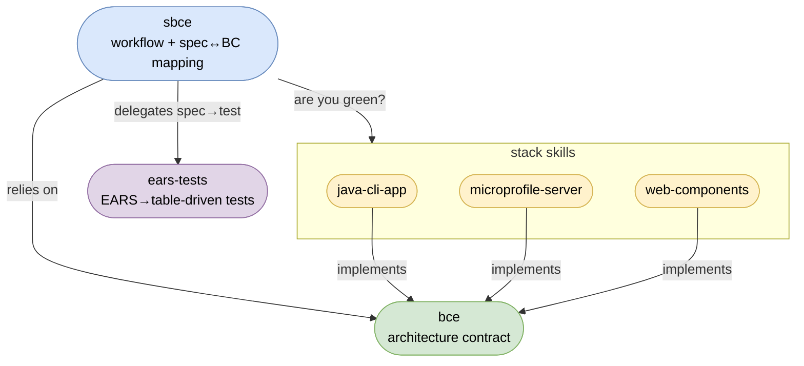

# sbce

An [AIrails.dev](https://airails.dev) skill for **[SBCE](https://sbce.space)** (pronounced *"space"*) — Spec-driven
BCE — the workflow where one capability spec equals one business component (same name) and the
spec is the boundary contract. One slash-invocable skill, two modes: `new → apply`
(declare → converge).

## Scope

- One skill, two modes — invoke as `/sbce new|apply <capability-or-feature>` (or by intent):
  - **new** (declare) — author the spec into the BC's package doc (`package-info.java` / `package-info.md`) and scaffold the BC's empty `boundary/control/entity` dirs. Accepts a BC name (one precise spec) **or** a natural-language feature description that decomposes into one or several BCs — coining new ones or extending existing specs, after you confirm the carving
  - **apply** (converge) — close the gap between spec and BC, then loop the stack's test suite until green (the kubectl/terraform "make it so" step)
- The identity is the **BC name** (`checkout`); the spec **is** the BC's package doc, co-located with the code — Java: `package-info.java` (`///` Markdown, [JEP 467](https://openjdk.org/jeps/467)), web: `package-info.md`. No separate `specs/` tree
- An **optional system doc** one altitude up — the base package's `package-info` — holds cross-BC concerns that have no other home: a one-line charter, an optional aspirational vision, the concrete BC-to-BC wiring and integration events, system-wide invariants, shared vocabulary, and the composed stack. Add it only when a real cross-cutting concern appears; a one-BC system needs none. Template: [references/system-doc-template.md](references/system-doc-template.md)
- An **optional top-level `README.md`** — a human on-ramp that *projects* the specs: a generated block (charter, vision, BC map) regenerated on `apply` inside `<!-- sbce:generated -->` markers, plus hand-maintained sections no spec covers (`## Conventions` for project-local standards, build/run via the stack skill). Never a source of truth. It also **doubles as the optional inception seed** `/sbce new` (no argument) reads to bootstrap the vision and specs. Template: [references/readme-template.md](references/readme-template.md)
- Stack-neutral — owns only the workflow and the spec↔BC mapping; no transport, types, or framework verbs in a spec
- No binary required: the **stack's own test loop is the oracle for "done"**.
## Composition

`sbce` is technology-agnostic: the only architecture it relies on are the [`bce`](../bce)
principles. It owns the workflow and the spec↔BC mapping; it delegates everything else, so
install these alongside it (all ship via airails `installSkills`):

- [`bce`](../bce) — the technology-neutral architecture contract (BCE layering, naming) every
  spec and BC is held against.
- [`ears-tests`](../ears-tests) — the EARS→table-driven test transform; turns each `Rn.m` into one labeled row, preserving the spec↔test trace.
- a **stack skill** — a technology-specific *implementation* of the `bce` principles, adding
  code idioms *and* verification: [`java-cli-app`](../java-cli-app)
  (`zunit`/`zb`), [`microprofile-server`](../microprofile-server) (integration + system tests),
  or [`web-components`](../web-components) (system tests + Playwright).

`sbce` never names a runner or a test kind; it asks the stack skill "are you green?". The spec
format and rules live in [SKILL.md](SKILL.md).



## Usage

Invoke `/sbce <mode> <bc-name>` (or just describe the intent — "declare a checkout
capability", "converge this BC to its spec"). Run the lifecycle in order:

1. **Declare** — `/sbce new checkout` *(BC name)* or
   `/sbce new "let a customer check out a cart"` *(feature description)*.
   If the input is vague, `new` first **loops clarifying questions until no boundary op or EARS
   requirement has to be guessed** — the spec is the test oracle, so it's never invented from
   ambiguity. A BC name then writes the spec into the BC's package doc
   (`package-info.java` as `///` Markdown, or `package-info.md` in web) and asks the stack skill to
   scaffold the BC's `boundary/control/entity` dirs. A feature description scans existing BCs,
   proposes a set (new ones + existing to extend) for you to confirm, then authors/extends one
   package doc per BC. Fill in the spec: boundary operations, requirements as EARS statements.
   Format: [references/spec-template.md](references/spec-template.md).
2. **Converge** — `/sbce apply checkout`
   Reads the gap **both directions** and closes it, bounded to ≤3 passes: *spec→code* adds the
   missing boundary methods, a traceable test per EARS id, and the code to pass them; *code→spec*
   surfaces drift — an undeclared method, an orphan trace id, an `entity` type absent from the spec
   — for you to declare or delete, never silently absorbed into the spec. Loops the stack's tests
   until green. Idempotent — re-run any time; an in-sync, green BC is a no-op.

Omit the mode and the skill infers it: a BC name or a feature description with no spec yet →
`new`; spec exists but not green → `apply`.

## Example Prompts

Each line below is a **complete prompt**: mode + BC name (or feature description) plus optional
free-form instructions that steer how the skill runs the mode — within its rules (confirm-first,
spec as source of truth, the stack's test loop as oracle).

- `/sbce new [BC name] — author the spec from the existing code as ground truth; flag anything that looks like a bug rather than intent instead of speccing it.`

  Brownfield adoption: reverse-engineer the spec for a BC that already has code but no package
  doc. The steering text grounds the clarify loop in the code instead of Q&A, and suspected bugs
  are surfaced for the user to decide — never silently codified as requirements.

- `/sbce new "let a customer check out a cart"`

  Feature declaration: decompose the description into BCs (new + existing to extend), confirm the
  carving, then author one package-doc spec per BC.

- `/sbce new`

  Inception: bootstrap the vision and initial specs from the hand-written prose in the top-level
  `README.md` seed.

- `/sbce apply [BC name]`

  Converge: read the spec↔code gap in both directions, close it, and loop the stack's tests until
  green.

- `/sbce apply [BC name] — report the gap only; list undeclared methods, orphan trace ids, and untested requirements without changing anything.`

  Dry run: the steering text limits `apply` to the gap report, deferring the converge step.

## Test

```
/sbce new checkout
```

Edit the generated spec, then converge:

```
/sbce apply checkout
```
