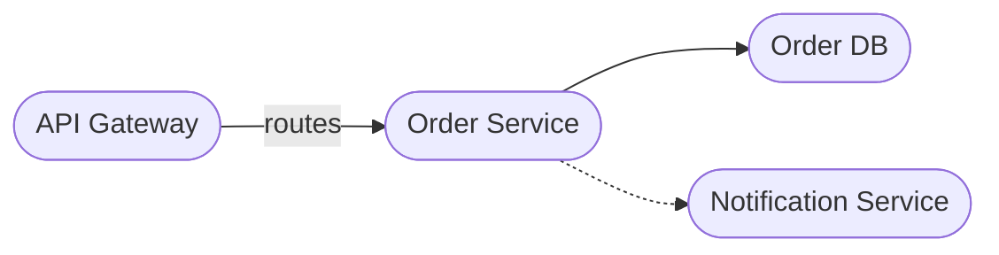

# Mermaid Overview Diagrams

## Rules
- prefer flowchart (graph) with TD or LR direction
- wrap in ` ```mermaid ` fenced code block
- use stadium-shaped nodes: `([text])`
- use meaningful node IDs reflecting component names
- use `-->` for dependencies, `-.->` for optional dependencies
- label arrows only when ambiguous: `Gateway -->|routes| Service`
- visualize only high-level concepts — omit classes, methods, implementation details
- use subgraphs sparingly for logical grouping
- write diagram into the target file (e.g. README.md) when context is clear

## Example


