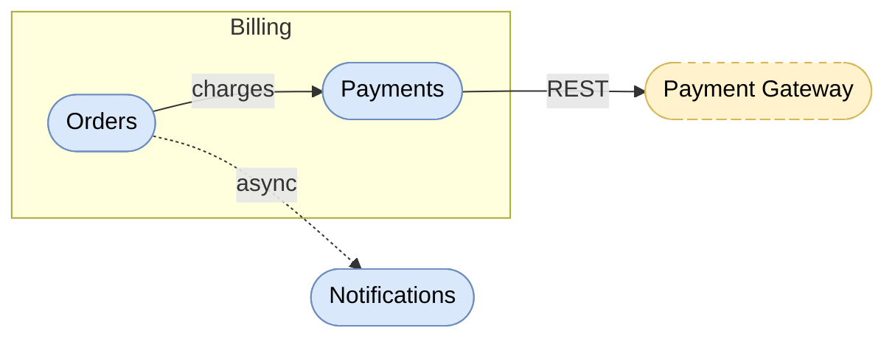

# Mermaid Overview Diagrams

## Rules

- prefer flowchart (graph) with TD or LR direction
- wrap in ` ```mermaid ` fenced code block
- use stadium-shaped nodes: `([text])`
- use meaningful node IDs reflecting component names
- use `-->` for dependencies, `-.->` for optional/async dependencies
- label arrows only when ambiguous: `Gateway -->|routes| Service`
- visualize only high-level concepts — omit classes, methods, implementation details
- use subgraphs for logical grouping (subsystems)
- write diagram into the target file (e.g. README.md) when context is clear

## BCE Shape Mapping

| Element | Mermaid syntax | Style class |
|---|---|---|
| Business Component (BC) | `Orders([Orders])` | `bc` |
| Subsystem | `subgraph Billing` | `subsystem` |
| External service | `PayGW([Payment Gateway])` | `ext` |
| Boundary layer | `Boundary([Boundary])` | `boundary` |
| Control layer | `Control([Control])` | `control` |
| Entity layer | `Entity([Entity])` | `entity` |

## Style Classes

Define these `classDef` entries at the end of the graph and apply with `class` or `:::`:

```
classDef bc fill:#dae8fc,stroke:#6c8ebf,color:#000
classDef ext fill:#fff2cc,stroke:#d6b656,color:#000,stroke-dasharray:5 5
classDef boundary fill:#d5e8d4,stroke:#82b366,color:#000
classDef control fill:#e1d5e7,stroke:#9673a6,color:#000
classDef entity fill:#fff2cc,stroke:#d6b656,color:#000
```

## Color Palette

- BC blue: fill `#dae8fc`, border `#6c8ebf`
- External yellow: fill `#fff2cc`, border `#d6b656`
- Boundary green: fill `#d5e8d4`, border `#82b366`
- Control purple: fill `#e1d5e7`, border `#9673a6`
- Entity yellow: fill `#fff2cc`, border `#d6b656`

## Example — Between Components


