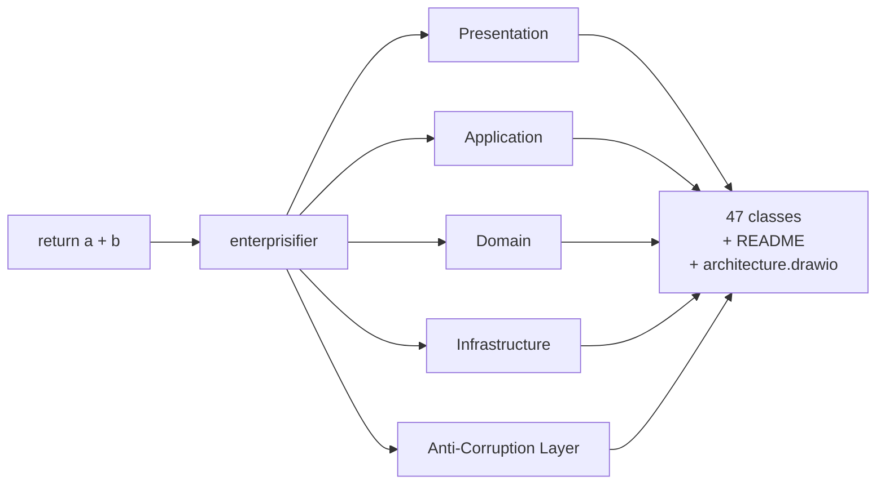

# enterprisifier

> **WARNING: Do not use in production.**
> Strictly for educational and entertainment purposes. Intentionally produces the most overcomplicated, pattern-saturated Java code possible. Applying it to real systems will result in unmaintainable software.

A Claude Code skill that transforms any piece of Java code into a maximally overengineered enterprise architecture — layered with unnecessary abstractions, design patterns, and indirections — to illustrate what *not* to do in production systems.

## How It Works



A one-liner expands into at least 30 files and 15 interfaces across five mandatory layers.

## Patterns Applied at a Glance

| Category | Examples |
|---|---|
| **Structural** | Facade, Proxy, Decorator, Adapter, Bridge, Composite, Flyweight |
| **Creational** | Abstract Factory, Builder, Singleton, Prototype, Factory Method |
| **Behavioral** | Strategy, Observer, Command, Chain of Responsibility, Mediator, Memento, State, Template Method, Visitor, Iterator, Interpreter |
| **Enterprise** | Hexagonal, Repository, Unit of Work, Specification, Domain Events, CQRS, Event Sourcing, Saga, Service Locator, DTO/VO separation |
| **Layering** | Presentation → Application → Domain → Infrastructure, with an ACL between every boundary |

Every pattern is applied to every input, regardless of size or complexity.

## Purpose

Demonstrates, through deliberate satire, the consequences of blindly applying enterprise patterns without regard for actual complexity requirements. Useful for:

- Teaching the difference between accidental and essential complexity
- Code review training: identifying over-abstraction
- Conference talks and workshops on software design anti-patterns

## Usage

Invoke via Claude Code:

```
/enterprisifier
```

Paste or reference the code to overengineer. The skill produces Java source files, a `README.md` documenting every applied pattern, and an `architecture.drawio` diagram.

## Example

See [enterprisifier-example](https://github.com/AdamBien/enterprisifier-example) for a sample output generated by this skill.

See [SKILL.md](SKILL.md) for the full pattern catalogue and output rules.
