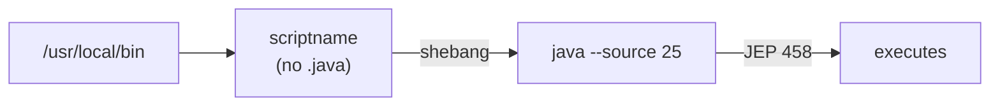

# java-cli-script

A skill for creating zero-dependency, executable Java 25 scripts for system-wide use via PATH — no build tool, no `.java` extension, just a shebang and `chmod +x`.

Composes with [`/java-conventions`](../java-conventions) for modern Java 25 code style, naming, and structure rules.

## How It Works



Scripts are single-file source-mode programs ([JEP 458](https://openjdk.org/jeps/458)) installed in a PATH directory and invoked like any shell command.

## Conventions at a Glance

| Category | Rule |
|---|---|
| **Shebang** | `#!/usr/bin/env -S java --source 25` — never `--enable-preview` |
| **Filename** | Lowercase, no `.java` extension, camelCase (no dashes) |
| **Main** | `void main(String... args) throws Exception` |
| **Naming** | Application name derived via `MethodHandles.lookup().lookupClass().getName()` |
| **Version** | `String version = "YYYY-MM-DD.N";` — bumped on every change |
| **Args** | `-help` and `-version` flags when the script takes arguments |
| **Output** | `IO.println()` for stdout, `System.err.println()` for errors |
| **Deps** | `java.base` and JDK modules only — no external JARs |

## Usage

Invoke via Claude Code:

```
/java-cli-script
```

Describe the script you want and the skill generates a single file plus installation instructions:

```bash
chmod +x scriptname
sudo cp scriptname /usr/local/bin/
```

## Companion Skills

- [`/zargs`](../zargs) — enum-based argument parsing for scripts with multiple options
- [`/zcl`](../zcl) — ANSI-colored terminal output
- [`/zcfg`](../zcfg) — zero-dependency configuration loading
- [`/java-cli-app`](../java-cli-app) — switch here when one file is no longer enough

See [SKILL.md](SKILL.md) for the full ruleset.
