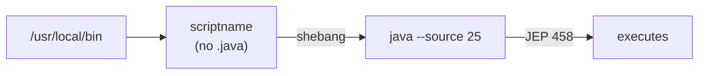

# java-cli-script

A skill for creating zero-dependency, executable Java 25 scripts for system-wide use via PATH — no build tool, no `.java` extension, just a shebang and `chmod +x`.

Composes with [`/java-conventions`](../java-conventions) for modern Java 25 code style, naming, and structure rules, and with [`/bce`](../../bce/bce) for layer grouping in longer scripts.

## How It Works


```mermaid
graph LR
    S["scriptname<br/>(no .java)"] -->|shebang| J["java --source 25"]
    J -->|JEP 458| EXEC["executes"]
    PATH["/usr/local/bin"] --> S
```

Scripts are single-file source-mode programs ([JEP 458](https://openjdk.org/jeps/458)) installed in a PATH directory and invoked like any shell command.

## Conventions at a Glance

| Category | Rule |
|---|---|
| **Shebang** | `#!/usr/bin/env -S java --source 25` — never `--enable-preview` |
| **Filename** | Lowercase, no `.java` extension, camelCase (no dashes) |
| **Main** | `void main(String... args) throws Exception` |
| **Naming** | Application name derived via `MethodHandles.lookup().lookupClass().getName()` |
| **Version** | `String version = "YYYY-MM-DD.N";` — bumped on every change |
| **Args** | `-help` and `-version` flags when the script takes arguments |
| **Output** | `IO.println()` for stdout, `System.err.println()` for errors |
| **Structure** | Members ordered Boundary → Control → Entity, `main` last; longer scripts group into layer interfaces |
| **Deps** | `java.base` and JDK modules only — no external JARs |

## BCE Layer Grouping

Short scripts stay flat: top-level methods, records, and enums ordered Boundary → Control → Entity, `main` last. Beyond roughly two screens (~150–250 lines), members move into three interfaces named after the [BCE](../../bce/bce) layers:

```java
interface Boundary { }  // coarse-grained facade, output adapters, NAME/VERSION constants
interface Control { }   // stateless static functions owning all I/O and traversal
interface Entity { }    // records and enums with state and behavior, no I/O

void main(String... args) throws Exception {
    Boundary.listBusinessComponents(List.of(args));
}
```

The interfaces are namespaces for developer experience — IDE outline, per-layer folding, layer-labeled call sites — with no enforcement ceremony: no constructors, no visibility modifiers. Past ~1000 lines even a grouped single file fights the medium; switch to [`/java-cli-app`](../java-cli-app) unless single-file deployment is the binding constraint. Reference implementation: [`zlsbc`](https://github.com/AdamBien/zeeds) in the zeeds repository.

## Usage

Invoke via Claude Code with a description of the script you want:

```
/java-cli-script create a health check for port 3000
```

The skill generates a single file plus installation instructions:

```bash
chmod +x scriptname
sudo cp scriptname /usr/local/bin/
```

## Companion Skills

- [`/zargs`](../zargs) — enum-based argument parsing for scripts with multiple options
- [`/zcl`](../zcl) — ANSI-colored terminal output
- [`/zcfg`](../zcfg) — zero-dependency configuration loading
- [`/bce`](../../bce/bce) — layer semantics behind the Boundary/Control/Entity grouping
- [`/java-cli-app`](../java-cli-app) — switch here when even a grouped single file is no longer enough

See [SKILL.md](SKILL.md) for the full ruleset.
