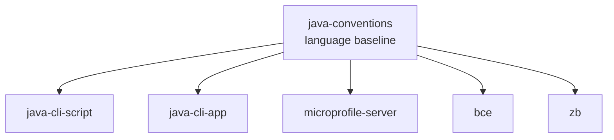

# java-conventions

A skill defining generic, composable Java 25 code conventions — syntax, style, naming, visibility, structure, methods, streams, exceptions, and documentation rules that apply across all Java contexts.

Technology-neutral within the Java world. Composes with context-specific skills and acts as the fallback baseline when they are silent.

## Composition Model

Composed skills always specialize, never contradict. When silent, `java-conventions` applies.

## Rules at a Glance

| Category | Examples |
|---|---|
| **Syntax** | `var`, records, sealed types, pattern matching, switch expressions, module imports, instance `void main()` |
| **Visibility** | Package-private over `private`, no `final` on fields/locals/params, field injection in CDI |
| **Types** | Records for data, sealed hierarchies for closed dispatch, interfaces only with >1 impl, `static` over `default` in utility interfaces |
| **Naming** | No `*Impl` / `*Service` / `*Manager` / `*Control`; no `get` prefix; protocol suffixes reserved for actual role |
| **Methods** | Short and cohesive, no multi-statement lambdas, method references over lambdas, named predicates over inline booleans |
| **Streams** | `Stream` over `for`, terminal operations that return values, `.toList()`, `List.of` / `Set.of` / `Map.of`, never `null` collections |
| **Style** | KISS / YAGNI, text blocks, `String.formatted()`, try-with-resources, guard clauses, enums over strings |
| **Exceptions** | Unchecked preferred, specific subclasses only, never swallow silently |
| **Comments** | Default to none; only the *why*, never the *what* |

## Scope

- Java 25 language-level rules (GA only — no `--enable-preview`)
- Code style, naming, visibility, methods, streams, exceptions, comments
- Excludes architecture (see `bce`), build and packaging (see `zb`), frameworks (see `microprofile-server`)

## Usage

Triggers on phrases like "Java conventions", "Java style", "modern Java", "Java 25", "idiomatic Java", or any request to write or review Java code where context-specific skills do not already cover style.

See [SKILL.md](SKILL.md) for the full ruleset.
