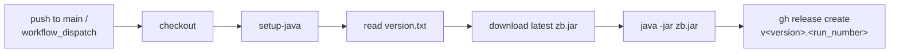

# zb-release-pipeline

A Claude skill that generates a GitHub Actions workflow for [zb](https://github.com/AdamBien/zb) (Zero Dependencies Builder) projects. The generated pipeline builds the project against the latest `zb.jar` and publishes a GitHub Release with the produced JAR attached.

## What It Generates

`.github/workflows/release.yml` — triggered on every push to `main` and via `workflow_dispatch`. Project-specific paths and names are auto-detected from the repository; nothing is hardcoded.



## Detection

The skill inspects the repository to resolve six template placeholders:

| Resolved value | Source |
|----------------|--------|
| Build directory | Directory containing the `.zb` config alongside `src/` (inner module in multi-module layouts) |
| Artifact path | `<build dir>/<jar.dir><jar.file.name>` from `.zb` (`jar.dir` defaults to `zbo/`) |
| Artifact name | `jar.file.name` without the `.jar` suffix |
| Version file | `version.txt` in the build directory, else repo root |
| zb.jar reference | Relative path from the build directory back to the repo root |
| Java version | `25` by default, or the level pinned in the build config |

## Release Output

| Element | Value | Example |
|---------|-------|---------|
| Asset (file) | `jar.file.name`, unversioned | `zsmith.jar` |
| Tag | `v<version>.<run_number>` | `v1.0.0.42` |
| Title | `<artifact name> <version> (build <run_number>)` | `zsmith 1.0.0 (build 42)` |

The stable asset name keeps `releases/latest/download/<artifact>.jar` working as a permanent download URL.

## Usage

Invoke the skill on a zb project:

```
/zb-release-pipeline
```

A `version.txt` (single line, e.g. `1.0.0`) is required for the release tag. If absent, the skill offers to create one. An existing `release.yml` is diffed and confirmed before overwriting.

## Notes

- No secrets required — the workflow uses the built-in `GITHUB_TOKEN` with `permissions: contents: write`.
- The pipeline always builds against the latest `zb.jar` release, so projects track zb improvements without manual bumps.
- No caching, matrices, or test steps are added — zb projects are zero-dependency and build in seconds. Tests run via the zb post-build hook.
