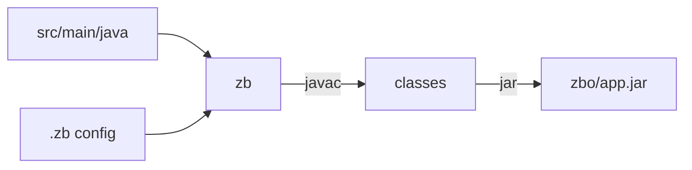

# zb

Agent instructions for building Java 25+ projects with [zb](https://github.com/AdamBien/zb) — a zero-dependency Java build tool. No Maven, no Gradle, no dependency resolution: just `javac` and an executable JAR.

## How It Works

zb auto-detects sources, compiles them, and packages an executable JAR with a `Main-Class` manifest entry.

## Conventions at a Glance

| Category | Default |
|---|---|
| **Java version** | 25+ required |
| **Source root** | `src/main/java` → `src/` → `.` (first match wins) |
| **Resources** | `src/main/resources` or current directory |
| **Entry point** | Exactly one class with a `void main(` method |
| **Output** | `zbo/app.jar` |
| **Config** | Optional `.zb` properties file in the build directory |
| **Scope** | Single-module, zero external dependencies |

## Usage

Two delivery modes — pick the one that matches your workflow:

### AGENTS.md — per-project context

Download `AGENTS.md` into a Java project root. AI coding agents pick it up automatically and learn how to build that project with zb. Use this when every agent session in that project should know about zb without explicit prompting.

### SKILL.md — reusable skill across projects

Install `SKILL.md` into your IDE's skills directory. It registers a `/zb` slash command available across all projects. Use this when you want to invoke zb instructions on demand from any workspace.

## Companion Skills

- [`/zunit`](../zunit) — run `*Test.java` files after a successful build
- [`/zb-release-pipeline`](../zb-release-pipeline) — generate a GitHub Actions release workflow for zb projects

See [SKILL.md](SKILL.md) for the full build instructions.
