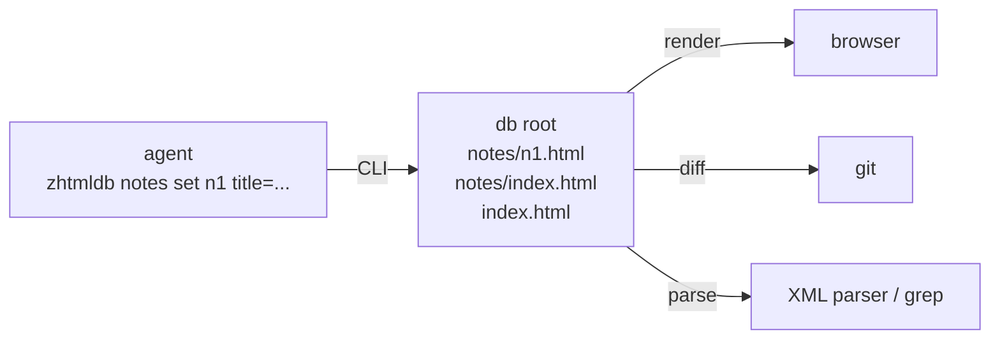

# zhtmldb

Agent instructions for using [zhtmldb](https://github.com/AdamBien/zhtmldb), a zero-dependency single-file Java 25 CLI, as persistent agent memory: notes, task lists, logs, configuration, research findings. Every record is an XHTML page in a folder, so the data is browsable in any browser, diffable with `git` and parseable as XML without a client library.

## How It Works



One table is one folder, one record is one `<table>/<key>.html` page holding its fields as `<dt>`/`<dd>` pairs. The CLI escapes values, keeps every page well-formed and regenerates the table and root `index.html` on each write.

## At a Glance

| Category | Detail |
|---|---|
| **Runtime** | Java 25+ on PATH |
| **Install** | `curl` the `zhtmldb` script, `chmod +x`, copy to `/usr/local/bin` |
| **Storage** | folder of XHTML pages, root is the current directory or `db.dir` |
| **Commands** | `set`, `add`, `get`, `rm`, `keys`, `find`, `list`, `columns`, `tables` |
| **Output** | data on stdout, tab separated; confirmations and errors on stderr; exit 1 on miss |
| **Personas** | a symlink named after a table becomes a dedicated CLI with its own `~/.<name>/app.properties` |

## Setup

```bash
command -v zhtmldb || {
  curl -O https://raw.githubusercontent.com/AdamBien/zhtmldb/main/zhtmldb
  chmod +x zhtmldb
  sudo cp zhtmldb /usr/local/bin/
}
```

Set the database root before the first write, either by running from the project root or with `db.dir=<path>` in `./app.properties` or `~/.zhtmldb/app.properties`.

## Usage

```bash
zhtmldb todos columns title,status,notes
zhtmldb todos add "Migrate config loading" open
zhtmldb todos list status=open
zhtmldb todos set 142122 status=done notes+="finished in commit a1b2c3"

zhtmldb memory set project-x stack="Java 25, zb" decisions+="keep single-file layout"
zhtmldb memory get project-x decisions
```

## Rules the Skill Enforces

- Declare `columns` before `add`; the order drives positional `set` and the index label.
- Keys are abbreviated on `set`, `get` and `rm`: a substring has to match exactly one key.
- Append with `field+=value` for logs; pass long or multi-line values on stdin.
- Look up with `find` and `cut -f1`, never parse `list` output.
- Do not edit pages by hand and do not store secrets.

## Companion Skills

- [`/java-cli-script`](../java-cli-script) — the single-file script format zhtmldb is built as
- [`/zcfg`](../zcfg) — the `app.properties` loading behind `db.dir` and persona configuration

See [SKILL.md](SKILL.md) for the full command contract, output conventions and recipes.
