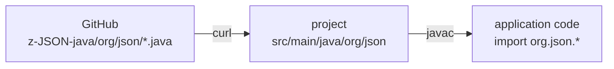

# zjson

Agent instructions for using JSON in zero-dependency Java by copying the [org.json](https://github.com/AdamBien/z-JSON-java) source — `JSONObject`, `JSONArray`, `JSONTokener` — directly into a project. No Maven, no Gradle, no dependency resolution: the three files compile alongside application code.

## How It Works



The `org/json` package is vendored into the project's source root with its `package org.json;` declaration unchanged, then imported with `import org.json.*;`.

## At a Glance

| Category | Detail |
|---|---|
| **Classes** | `JSONObject`, `JSONArray`, `JSONTokener` |
| **Package** | `org.json` (kept as-is, not repackaged) |
| **Java version** | 21+ (developed against 25) |
| **Dependencies** | none — source is copied, not resolved |
| **Build** | compiles with [`/zb`](../zb) or plain `javac` |
| **Not included** | `JSONStringer`, `JSONWriter`, XML/CDL/HTTP conversion |

## Integration

Pull the package straight from GitHub — `curl` only, works on any machine, no checkout required:

```bash
for f in JSONObject JSONArray JSONTokener; do
  curl -sf "https://raw.githubusercontent.com/AdamBien/z-JSON-java/main/src/main/java/org/json/$f.java" \
    -o "src/main/java/org/json/$f.java" --create-dirs
done
```

If a local `z-JSON-java` checkout and the `zjsoncp` script happen to be installed, `zjsoncp` copies the same package locally as a convenience.

## Usage

```java
import org.json.*;

JSONObject obj = new JSONObject("""
    {"name":"Duke","tags":["java","jvm"]}
    """);
String name = obj.getString("name");

JSONObject out = new JSONObject()
        .put("name", "Duke")
        .put("tags", new JSONArray().put("java").put("jvm"));
String pretty = out.toString(2);
```

## Companion Skills

- [`/zb`](../zb) — build the project after copying the source in
- [`/java-cli-script`](../java-cli-script) — single-file scripts that consume the copied `org.json`

See [SKILL.md](SKILL.md) for the full API and integration rules.
