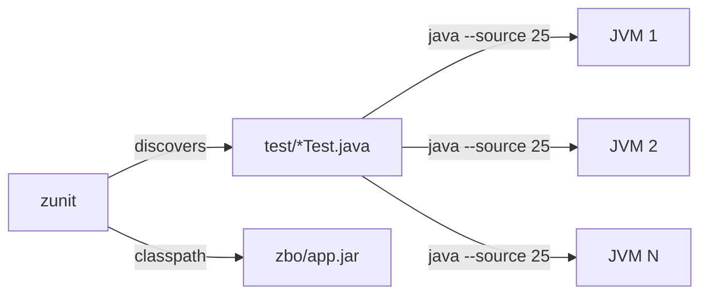

# zunit

Zero-dependency test runner for [java-cli-app](../java-cli-app) projects. Discovers `*Test.java` files and runs each directly via `java --source 25` — no compilation step, no JUnit, no framework.

## How It Works



Each test file runs concurrently in a separate JVM. A thrown exception or non-zero exit means failure; clean exit means success.

## Test Convention

Test files live in `test/`, use unnamed class style, and assert with `assert` or `Objects.equals`:

```java
void main() {
    var result = Converter.toFahrenheit(0);
    assert result == 32 : "expected 32 but got " + result;

    var name = Greeter.greet("Duke");
    assert Objects.equals(name, "Hello, Duke") : "unexpected: " + name;
}
```

No package declarations, no assertion libraries, no imports needed for `java.base` types. Run with `-ea` enabled by default.

## Usage

```
zb && zunit
```

Build with [zb](../zb) first to produce `zbo/app.jar`, then run `zunit` to discover and execute all tests. Use `zunit -verbose` to debug classpath or discovery issues.
