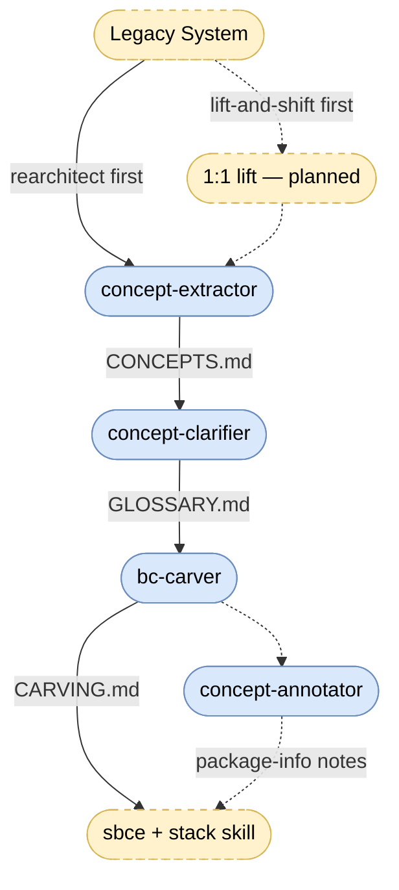

# Migrations

Skills for migrating legacy, overengineered, untested enterprise systems to BCE — first recovering the domain language buried in the system's names, then deciding the component cut, then executing it incrementally with [sbce](../bce/sbce/) and a stack skill. Every step until execution is documentation-only: the running system is never at risk, and each stage produces a reviewable artifact a human confirms before the next stage consumes it.

## Skills

| Skill | Produces |
|---|---|
| [concept-extractor](concept-extractor/) | `migration/CONCEPTS.md` — mined concepts with aliases, evidence, co-occurrence; seeds `migration/GLOSSARY.md` |
| [concept-clarifier](concept-clarifier/) | confirmed glossary entries with provenance — resolves open questions with a domain expert, live or via `migration/INTERVIEW.md` |
| [bc-carver](bc-carver/) | `migration/CARVING.md` — candidate BC map plus the as-is → to-be diff; the incremental-refactoring backlog |
| [concept-annotator](concept-annotator/) | `package-info.java` migration notes per package — the code describes its own concepts, target BC, and refactoring hints |

All skills are explicitly invoked (`/concept-extractor`, …), write candidates for human review — never verdicts — and share contracts: pipeline artifacts live in the analyzed project's `migration/` folder, open questions carry stable Q-ids across artifacts, and `GLOSSARY.md` is the single durable decision store. The `migration/` folder is disposable after the migration; the glossary is cargo — it becomes the ubiquitous language of the new system.

## Choosing the Entry Path

Project-dependent — some projects lift, others rearchitect directly:

- **Lift-and-shift first** when the system must keep running through a long migration, platform EOL pressure is real, or behavior risk dominates. A lift is a first step with an expiry date, not a destination — the `CARVING.md` diff and package-info notes are the written record that it isn't done.
- **Rearchitect directly** when the system is small or well-understood enough that double handling isn't worth it.

Steps are individually skippable: on small systems the clarifier may be a single live round, and the annotator is optional throughout. Use what the project needs — the pipeline is a menu, not a liturgy.

## Open Gaps

- **1:1 lift skill** — planned; a `j2ee-migration` PoC exists outside this repo as raw material.
- **Behavior recovery / characterization tests** — specs need behavior, not just names; an untested legacy system's rules live only in its code. Capture before the lift, replay after — not yet covered.
