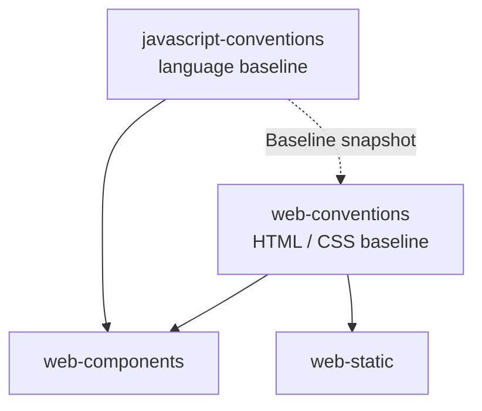

# javascript-conventions

Generic, composable JavaScript conventions — modules, declarations, functions, collections, asynchrony, errors, JSDoc types, naming, and the Baseline lookup that decides which language and standard-library features may be used.

The language-level counterpart of [java-conventions](../java-conventions), and the JavaScript half of the web baseline: [web-conventions](../web-conventions) owns HTML and CSS and deliberately leaves JavaScript out of scope.

## Composition Model

`web-static` forbids JavaScript, so `web-components` is the composing stack skill today. Composed skills always specialize, never contradict. When silent, `javascript-conventions` applies.

## Language Level

Target the newest ECMAScript the Baseline policy permits — the decision is **per feature**, never per year. No transpiler, no polyfill bundle, no TypeScript: a feature that needs compiling is a feature whose Baseline status already rules it out.

Statuses come from [`web-conventions/references/baseline-snapshot.md`](../web-conventions/references/baseline-snapshot.md), never from model memory. Where CSS detects with `@supports`, JavaScript uses an existence check before first use.

| Status | Rule | Examples (2026-07-08 snapshot) |
|---|---|---|
| **Widely** | use freely | `toSorted()`/`with()`, `structuredClone()`, `Error` `cause`, `Object.hasOwn()`, `URL.canParse()`, import maps |
| **Newly** | existence check plus fallback | `Object.groupBy()`, `Set` methods, iterator helpers, `Promise.withResolvers()`, `URLPattern`, Navigation API |
| **Limited** | prohibited | top-level `await`, `using` declarations, `Temporal`, import assertions, `requestIdleCallback()` |

Widely-known features can still be Limited — top-level `await` is, which is precisely why the status is looked up rather than recalled.

## Rules at a Glance

| Category | Examples |
|---|---|
| **Modules** | One ES module per file, named exports, import maps for bare specifiers, no CommonJS, no import-time side effects |
| **Syntax** | `const` by default, `===` only, destructuring in the parameter list, `?.` / `??` over `&&` and `\|\|`, no `var` |
| **Functions** | Arrows by default, single-expression callbacks, named functions passed directly, guard clauses, named predicates |
| **Data** | Immutable by copy (`toSorted`, `with`), array methods over loops, `Map`/`Set` for lookups, never `null` collections |
| **Async** | `await` over `.then()`, `Promise.all` for independent work, `AbortSignal` on cancellable fetches, no floating promises |
| **Errors** | `Error` with `cause`, `catch { }` for unused bindings, never swallow, always check `response.ok` |
| **Types** | JSDoc `@param` / `@returns` / `@typedef` — no TypeScript, no JSX |
| **Platform** | `URL`, `Intl`, `fetch`, `structuredClone` over lodash, moment, date-fns, axios |

## Scope

- JavaScript language-level rules and the JavaScript Baseline lookup
- Excludes HTML and CSS (see `web-conventions`), and architecture, state, routing, dependencies, build, and verification (see `web-components`, `bce`)

## Usage

Triggers on phrases like "JavaScript conventions", "JS style", "modern JavaScript", "ES modules", "JSDoc types", or any request to write or review JavaScript where context-specific skills do not already cover style.

See [SKILL.md](SKILL.md) for the full ruleset.
